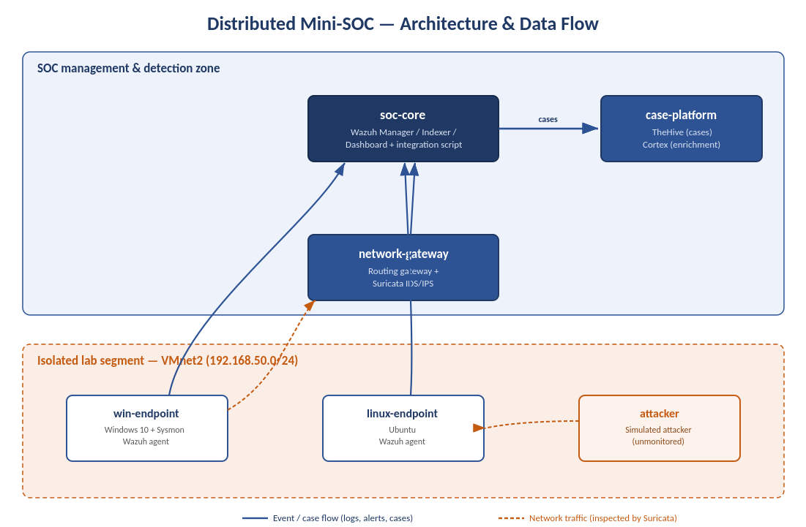

# Distributed Mini-SOC

**A small but production-minded Security Operations Center, built from scratch across six machines — with a focus on reliability, detection quality, and detection engineering.**

> Personal project developed during my M2 cybersecurity internship (Université de Limoges — CRYPTIS). All architecture, deployment, custom integration and detection engineering were designed and implemented by me.

---

## What this project is

A [SOC](https://en.wikipedia.org/wiki/Information_security_operations_center) is the function responsible for **detecting, investigating and responding to security incidents**. This project builds a realistic, distributed mini-SOC on an isolated lab network — not just installing tools, but making the platform *reliable*, *low-noise*, and *effective at catching real attacks*.

The goal: reproduce, at small scale, the engineering discipline behind a SOC that could plausibly be handed to a small business — every component supervised, false positives tuned, incidents investigated end-to-end, and detection gaps found and closed.

---

## Architecture



Six virtual machines on an isolated lab network, each with a dedicated role:

| Component | Role | Core software |
|---|---|---|
| **soc-core** | Central log manager, indexer, dashboard + custom integration | Wazuh Manager / Indexer / Dashboard |
| **network-gateway** | Routing gateway and network intrusion detection | Suricata 8.0.5 (IDS/IPS-capable) |
| **case-platform** | Case management and enrichment | TheHive 5.6.3 + Cortex 3.1.8 (Docker) |
| **win-endpoint** | Monitored Windows endpoint | Windows 10, Sysmon 15.20, Wazuh agent |
| **linux-endpoint** | Monitored Linux endpoint | Ubuntu, Wazuh agent |
| **attacker** | Simulated attacker (unmonitored) | Kali Linux |

**Detection pipeline:** endpoints and the network sensor forward events to the central manager, which correlates them and — through a custom integration I wrote — creates investigation cases in the case-management platform. Machine names are decoupled from IP addresses, so the platform survives frequent network changes without reconfiguring the agents.

*Network addresses are anonymised in this public repository.*

---

## Highlights

### Reliability — a SOC that supervises itself

A core design principle: **the component supervising a system must not depend on the system it supervises.** I built dedicated health monitoring for the pipeline, the network sensor, and the case platform — so any failure is itself detected and alerted.

- Pipeline-failure detection in **under 2 seconds** (down from over 30 minutes)
- Case-platform outage detected in **37 seconds** by an external probe
- **100% network visibility** — 293,180 packets inspected, zero loss

### Detection quality — false-positive tuning

A SOC drowning in noise hides real threats. Using a systematic six-step methodology, I reduced alert noise by **54.6%** on a representative baseline — **without creating blind spots**.

Key principle applied: a useful detection rule is never disabled. Instead, a narrow multi-condition exception is added so the exclusion cannot be exploited. Lowered events stay fully archived, so tuning never becomes silent filtering.

### Prevention capability (IPS)

Demonstrated active blocking of an attack in a controlled, fully reversible setup: the same signature shown first passing (IDS mode) then blocked (IPS mode), with the engine confirming packets were dropped. The exercise also surfaced a genuine architectural insight — *an inline IPS can only block traffic that physically traverses the gateway* — documented rather than glossed over.

### Investigation — turning cases into outcomes

I demonstrated the full incident lifecycle in the case-management platform: triage → assignment → evidence and MITRE ATT&CK review → verdict → closure with a written conclusion. Two contrasting cases:

| Case | Type | Verdict | MTTR |
|---|---|---|---|
| Windows Update traffic | Network alert | False Positive | 17 min |
| SSH lateral movement | Endpoint alert | True Positive (with impact) | 6 min |

The ability to distinguish a benign false alarm from a genuine attack, qualify each differently, and record every decision is precisely what separates a *deployed* SOC from an *operated* one.

### Detection engineering — closing blind spots

I ran real attack techniques against the lab, observed that some went **undetected**, then diagnosed and closed each gap — the full detection-engineering cycle.

- **[T1053.005](https://attack.mitre.org/techniques/T1053/005/) — Persistence via scheduled task:** the event was collected but no rule alerted on it → I built two tiered detection rules; the attack, replayed, was correctly detected and a case was raised automatically.

- **[T1003.001](https://attack.mitre.org/techniques/T1003/001/) — Credential access via LSASS dump:** the sensor was not even collecting the relevant event → I reconfigured endpoint monitoring, wrote a detection rule, then calibrated it against **26 false positives generated by the antivirus itself**, distinguishing a real memory dump from legitimate access by the privilege level requested. Defence-in-depth observed in action: the antivirus blocked the attack while the SOC detected it.

---

## Key results

| Indicator | Result |
|---|---|
| Network traffic visibility | 100% (293,180 packets, zero loss) |
| Pipeline-failure detection | under 2 seconds (from >30 min) |
| Platform-outage detection | 37 seconds |
| Alert-noise reduction | 54.6% on representative baseline |
| Alert deduplication | 2,106 alerts → 1 case |
| Investigation MTTR | 6–17 minutes |
| MITRE techniques covered | Recon, execution, lateral movement, persistence, credential access |

---

## Skills demonstrated

- **Custom software engineering** — a ~1,000-line Python integration linking the detection engine to the case-management platform, with two-level deduplication and source-based correlation. Most projects use off-the-shelf connectors; I wrote mine.
- **Detection engineering** — writing, testing and calibrating detection rules against real traffic, distinguishing malicious from legitimate behaviour by precise technical criteria.
- **Reliability engineering** — designing a system that detects its own failures.
- **Sound engineering judgement** — documenting limitations honestly as improvement areas rather than hiding them; distinguishing a true positive with impact from one without.
- **Operational rigour** — systematic version control, backups before every change, validation before every restart, clean lab state after every attack test.

---

## Repository contents

```
├── docs/
│   └── architecture.png        Architecture diagram and data flows
├── examples/
│   ├── detection-rules/        Selected Wazuh detection rules (tuning + MITRE coverage)
│   └── integration/            Representative excerpt of the custom integration script
└── README.md
```

> This is a **showcase** repository with selected, sanitised extracts of a larger private project. Full configuration is kept private for security reasons — which is itself the correct operational practice.

---

## Tech stack

`Wazuh` · `Suricata` · `Sysmon` · `TheHive` · `Cortex` · `MITRE ATT&CK` · `Docker` · `Python` · `Bash` · `Git`

---

*Built by Abed el rahman Ismaiil — M2 CRYPTIS, Université de Limoges · 2026*
