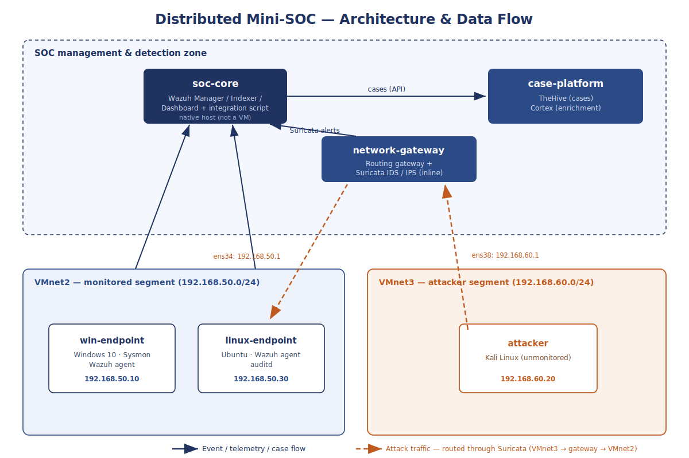

# Distributed Mini-SOC

**A small but production-minded Security Operations Center, built from scratch across six machines (five VMs + one physical host) — with a focus on reliability, detection quality, and detection engineering.**

> Personal project developed during my M2 cybersecurity internship (Université de Limoges — CRYPTIS), May–August 2026. All architecture, deployment, custom integration and detection engineering were designed and implemented by me.

---

## What this project is

A [SOC](https://en.wikipedia.org/wiki/Information_security_operations_center) is the function responsible for **detecting, investigating and responding to security incidents**. This project builds a realistic, distributed mini-SOC on an isolated lab network — not just installing tools, but making the platform *reliable*, *low-noise*, and *effective at catching real attacks*.

The goal: reproduce, at small scale, the engineering discipline behind a SOC that could plausibly be handed to a small business — every component supervised, false positives tuned, incidents investigated end-to-end, and detection gaps found and closed.

---

## Architecture



Six machines on an isolated lab network — **five virtual machines and one physical host** — each with a dedicated role:

| Component | Role | Core software | Hosting |
| --- | --- | --- | --- |
| **soc-core** | Central log manager, indexer, dashboard + custom integration | Wazuh Manager / Indexer / Dashboard | **Native Ubuntu (physical host)** |
| **network-gateway** | Routing gateway and network intrusion detection | Suricata 8.0.5 (IDS/IPS-capable) | VM |
| **case-platform** | Case management and enrichment | TheHive 5.6.3 + Cortex 3.1.8 (Docker) | VM |
| **win-endpoint** | Monitored Windows endpoint | Windows 10, Sysmon 15.20, Wazuh agent | VM |
| **linux-endpoint** | Monitored Linux endpoint | Ubuntu, Wazuh agent + auditd | VM |
| **attacker** | Simulated attacker (unmonitored) | Kali Linux | VM |

`soc-core` runs **natively**, not in a VM: the hypervisor laptop could not absorb Wazuh's memory footprint on top of the five VMs. The secondary laptop runs close to its limit — the least scalable point in the architecture, explicitly identified and discussed as a limitation.

**Detection pipeline:** endpoints and the network sensor forward events to the central manager, which correlates them and — through a custom integration I wrote — creates investigation cases in the case-management platform. Two Python components sit at the core:

- a **~1,700-line integration script** (Wazuh → TheHive) with **two-level deduplication** — case-level grouping by source, and signature-level rate limiting — so one phenomenon does not spawn dozens of cases;
- a **dedicated Python service** that preprocesses LSASS access-right bitmasks and feeds qualified JSON events back into Wazuh.

Machine names are decoupled from IP addresses, so the platform survives frequent network changes without reconfiguring the agents.

*Network addresses are anonymised in this public repository.*

---

## Highlights

### Reliability — a SOC that supervises itself

A core design principle: **the component supervising a system must not depend on the system it supervises.** Each link (integration pipeline, network sensor, case platform) is watched by a probe independent of the component it observes, so any failure is itself detected and alerted. Detection logic lives in a testable script, not in the rules — the rules only react to explicit log messages, which makes the behaviour independently verifiable.

- Pipeline-failure detection in **≈2 seconds**
- Application-unavailability detection in **37 seconds** via an independent probe
- **100% network visibility** — 293,180 / 293,180 packets, zero kernel packet loss
- TheHive API response recovered from a **>10 s timeout to 2–3 ms**; swap usage cut from **864 → 68 MiB**

### Detection quality — false-positive tuning

A SOC drowning in noise hides real threats. Using a systematic, reusable methodology, I reduced alert noise by **54.6% (897 of 1,643 alerts)** on a representative observation window — with **no additional blind spot identified in the validation scenarios**.

Key principle applied: a useful detection rule is never disabled. Instead, a narrow multi-condition exception is added so the exclusion cannot be exploited, and lowered events stay fully archived — tuning never becomes silent filtering. *(The 54.6% figure is specific to the observed window, not a constant rate.)*

### Prevention capability (IPS)

Demonstrated active blocking of an attack in a controlled, fully reversible setup: the same signature shown first passing (IDS mode) then blocked (IPS mode, `action=blocked`), with the engine confirming packets were dropped — after which the platform was deliberately returned to normal IDS operation. The exercise also surfaced a genuine architectural insight — *an inline IPS can only block traffic that physically traverses the gateway* — documented rather than glossed over.

### Investigation — turning cases into outcomes

I demonstrated the full incident lifecycle in the case-management platform: triage → assignment → evidence and MITRE ATT&CK review → verdict → closure with a written conclusion. The final validation set was deliberately varied:

| Case | Rule | ATT&CK | Verdict |
| --- | --- | --- | --- |
| TCP SYN scan | 100202 | T1046 | True positive — no confirmed impact |
| LSASS access | 100330 | T1003.001 | True positive — no confirmed impact |
| Linux account discovery | 100204 | T1087.001 | True positive — no confirmed impact |
| Benign background reads | 100204 (pre-tuning) | T1087.001 | False positive → rule tuned to require an interactive TTY |

Resolution times ranged from **6 min 28 s** (false-positive case) to **16 min 17 s** (deepest true-positive case). The ability to distinguish a benign false alarm from a genuine attack, qualify each honestly (a true positive *without* confirmed impact is not inflated into a breach), and record every decision is precisely what separates a *deployed* SOC from an *operated* one.

### Detection engineering — closing blind spots

I ran real attack techniques against the lab, observed that some went **undetected**, then diagnosed and closed each gap — the full detection-engineering cycle.

- **[T1053.005](https://attack.mitre.org/techniques/T1053/005/) — Persistence via scheduled task:** the event was collected but no rule alerted on it → I built two tiered detection rules (100320 / 100321); the attack, replayed, was correctly detected and a case was raised automatically.
- **[T1003.001](https://attack.mitre.org/techniques/T1003/001/) — Credential access via LSASS dump:** the sensor was not even collecting the relevant event → I reconfigured endpoint monitoring, then wrote a detector (rule 100330) that reads the `PROCESS_VM_READ` bit directly from `GrantedAccess` via a bitwise test `(value & 0x10)`. Validated with four complementary tests: `0x1410` fired, `0x1050` still detected (`0x1050 & 0x10 = 0x10`), `0x1000` correctly ignored, and a recurrent benign `wmiprvse.exe` access matching the measured baseline was excluded from alerting. Defence-in-depth observed in action.
- **[T1087.001](https://attack.mitre.org/techniques/T1087/001/) — Account discovery on Linux:** an interactive `python3` read of `/etc/passwd` → identity-based rule 100204 (interactive-TTY condition), tuned to exclude benign `systemd`/`landscape` background reads. The attacker address was correlated from the preceding SSH event.

---

## Key results

| Indicator | Result |
| --- | --- |
| Network traffic visibility | 100% (293,180 packets, zero kernel loss) |
| Pipeline-failure detection | ≈2 seconds |
| Application-unavailability detection | 37 seconds |
| TheHive API response time | >10 s timeout → 2–3 ms |
| Alert-noise reduction | 54.6% (897 of 1,643 alerts, representative window) |
| IPS blocking | `action=blocked` (demo, then reverted to IDS) |
| Investigation resolution | 6–16 min per case |
| MITRE techniques exercised | T1046, T1053.005, T1003.001, T1087.001 (SSH-from-untrusted rule for T1021.004) |

---

## Skills demonstrated

- **Custom software engineering** — a ~1,700-line Python integration linking the detection engine to the case-management platform (two-level deduplication, source-based correlation), plus a dedicated Python service for LSASS bitmask preprocessing. Most projects use off-the-shelf connectors; I wrote mine.
- **Detection engineering** — writing, testing and calibrating detection rules against real traffic, distinguishing malicious from legitimate behaviour by precise technical criteria (identity/TTY, GrantedAccess bitmask, flow state).
- **Reliability engineering** — designing a system that detects its own failures, with supervision decoupled from the supervised component.
- **Sound engineering judgement** — documenting limitations honestly as improvement areas rather than hiding them; not inflating a true positive without impact into a breach.
- **Operational rigour** — systematic version control, backups before every change, validation before every restart, clean lab state after every attack test.

---

## Repository contents

```
├── docs/
│   └── final-architecture.png        Architecture diagram and data flows
├── examples/
│   ├── detection-rules/        Selected Wazuh detection rules (tuning + MITRE coverage)
│   └── integration/            Representative excerpt of the custom integration script
└── README.md
```

> This is a **showcase** repository with selected, sanitised extracts of a larger private project. Full configuration is kept private for security reasons — which is itself the correct operational practice.

---

## Tech stack

`Wazuh` · `Suricata` · `Sysmon` · `TheHive` · `Cortex` · `MITRE ATT&CK` · `Docker` · `Python` · `Bash` · `Git`

---

*Built by Abed El Rahman Ismaiil — M2 CRYPTIS, Université de Limoges · 2026*
*[LinkedIn](https://www.linkedin.com/in/abed-el-rahman-ismaiil)*
